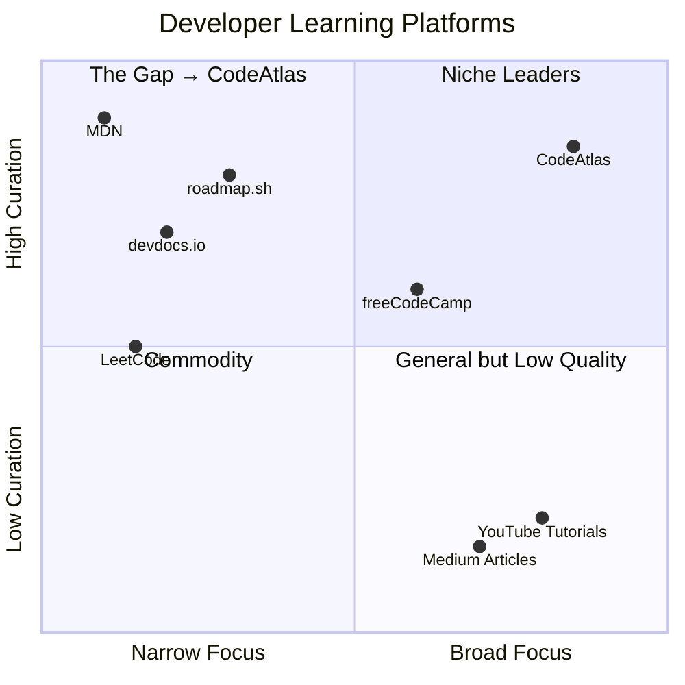

# Product Requirements Document: CodeAtlas

> **Version:** 1.1.0  
> **Status:** Active  
> **Last Updated:** 2026-05-31  
> **Author:** Product Team

---

## Table of Contents

1. [Executive Summary](#executive-summary)
2. [Problem Statement](#problem-statement)
3. [Target Audience](#target-audience)
4. [User Personas](#user-personas)
5. [Market Analysis](#market-analysis)
6. [Competitor Analysis](#competitor-analysis)
7. [Product Vision](#product-vision)
8. [Core Features](#core-features)
9. [Functional Requirements](#functional-requirements)
10. [Non-Functional Requirements](#non-functional-requirements)
11. [User Flows](#user-flows)
12. [Success Metrics & KPIs](#success-metrics--kpis)
13. [Future Features](#future-features)
14. [Monetization Strategy](#monetization-strategy)
15. [Risks & Mitigations](#risks--mitigations)
16. [Technical Constraints](#technical-constraints)
17. [Development Phases](#development-phases)
18. [Release Criteria](#release-criteria)
19. [Appendix](#appendix)

---

## Executive Summary

CodeAtlas is a comprehensive developer learning platform that consolidates programming language learning, cheat sheets, documentation, resource directories, AI/ML education, technology roadmaps, interview preparation, and developer tools into one cohesive experience.

**Current State (May 2026):** MVP launched with complete content across 9 categories, 50+ technologies, 100+ developer tools, 30+ books, 13 career roadmaps, and interview preparation. The platform operates as a static React SPA with no backend.

**Target State:** A full-stack platform with user accounts, progress tracking, AI-powered recommendations, community features, and mobile apps — serving as the go-to learning resource for developers worldwide.

**Key Metrics:** 500K organic monthly visitors, 100K registered users, 4.5+ user satisfaction rating within 12 months of launch.

---

## Problem Statement

### The Problem

Developers face a fragmented learning ecosystem. No single platform provides:

- **Structured learning paths** (like roadmap.sh)
- **Quick reference** (like devdocs.io)
- **Comprehensive resources** (like freeCodeCamp)
- **Tool discovery** (like Slant or G2)
- **Interview preparation** (like LeetCode)
- **Book recommendations** (like Goodreads for tech)

Developers must visit 5-10 different websites to accomplish what should be a unified learning workflow. This fragmentation causes:

- **Decision fatigue** — "What should I learn next?"
- **Context switching** — "Where did I save that resource?"
- **Quality uncertainty** — "Is this tutorial up-to-date?"
- **Progress blindness** — "How far have I come?"

### The Solution

CodeAtlas solves this by being the **single source of truth** for developer learning — a comprehensive map (hence the name) that shows where you are, where you can go, and how to get there.

---

## Target Audience

### Primary Segments

| Segment | Size (Global) | Pain Point | CodeAtlas Solution |
|---------|---------------|------------|-------------------|
| CS Students | 25M | No structured path beyond curriculum | Learning paths, roadmaps, cheat sheets |
| Junior Developers | 15M | Impostor syndrome, too many resources | Curated beginner resources, project ideas |
| Mid-Level Engineers | 20M | Need to upskill for senior roles | AI/ML content, system design prep |
| Career Switchers | 5M | Don't know where to start | Complete roadmaps from zero |
| AI/ML Engineers | 8M | Fast-moving field, quality filtering | Curated AI/ML resources, paper guides |

### Secondary Segments

| Segment | Size (Global) | Pain Point |
|---------|---------------|------------|
| Tech Leads | 5M | Need to evaluate tools, guide teams |
| DevOps Engineers | 6M | Tool complexity, certification prep |
| Data Scientists | 4M | Engineering skills gap |
| Cybersecurity Pros | 3M | Certification paths, tool knowledge |

---

## User Personas

### Persona 1: Alex Chen — "The Rookie Dev"

| Attribute | Detail |
|-----------|--------|
| **Age** | 20 |
| **Role** | 2nd year CS student |
| **Skill Level** | Beginner |
| **Goal** | Get a software engineering internship |
| **Frustrations** | Tutorial hell, too many resources, no clear path |
| **Session** | 2-3 hours structured study daily |
| **Key Needs** | Learning paths, cheat sheets, project ideas, interview prep |
| **Device** | Laptop (primary), phone (quick reference) |

### Persona 2: Jordan Smith — "The Mid-Level Climber"

| Attribute | Detail |
|-----------|--------|
| **Age** | 28 |
| **Role** | Full-stack developer, 4 years experience |
| **Skill Level** | Intermediate |
| **Goal** | Senior role, transition to AI/ML |
| **Frustrations** | Scattered AI resources, system design complexity |
| **Session** | 1-2 hours weekdays, 4-5 hours weekends |
| **Key Needs** | AI/ML curriculum, system design prep, advanced resources |
| **Device** | Laptop + external monitor |

### Persona 3: Priya Patel — "The Tech Lead"

| Attribute | Detail |
|-----------|--------|
| **Age** | 35 |
| **Role** | Tech Lead, 10 years experience |
| **Skill Level** | Expert |
| **Goal** | Guide team skill development, evaluate tools |
| **Frustrations** | Outdated docs, too many tools, hard to compare |
| **Session** | 15-30 min quick references |
| **Key Needs** | Tool comparisons, documentation links, team resources |
| **Device** | Desktop (work), tablet (meetings) |

### Persona 4: Marcus Williams — "The Career Switcher"

| Attribute | Detail |
|-----------|--------|
| **Age** | 32 |
| **Role** | Finance professional → aspiring developer |
| **Skill Level** | Complete beginner |
| **Goal** | Full career change to software development |
| **Frustrations** | Overwhelming choices, impostor syndrome |
| **Session** | 2 hours evenings, full weekends |
| **Key Needs** | Complete roadmaps from zero, fundamental resources |
| **Device** | Laptop (evening study), phone (commute) |

### Persona 5: Sarah Kim — "The AI Specialist"

| Attribute | Detail |
|-----------|--------|
| **Age** | 27 |
| **Role** | ML Engineer, MS in ML |
| **Skill Level** | Advanced |
| **Goal** | Stay current with LLMs, find implementation guides |
| **Frustrations** | Fast-moving field, information overload |
| **Session** | 30 min daily reading, longer on weekends |
| **Key Needs** | LLM resources, paper guides, implementation tutorials |
| **Device** | Multi-monitor desktop |

---

## Market Analysis

### Total Addressable Market (TAM)

| Metric | Value |
|--------|-------|
| Global developer population | 30M+ |
| Developer education market (2026) | $8B+ |
| Market CAGR | 15%+ |
| Online learning platform users | 500M+ |
| Developer tool market | $40B+ |

### Market Trends

1. **AI/ML is the #1 upskilling priority** — 70% of developers plan to learn AI in 2026
2. **Self-directed learning dominates** — 80% of developers learn through online resources
3. **Content fragmentation is worsening** — Average developer uses 7+ learning platforms
4. **Quality over quantity** — Developers increasingly value curated over algorithm-generated content
5. **Mobile learning is growing** — 40% of learning sessions start on mobile

### Market Gap



---

## Competitor Analysis

### Direct Competitors

| Competitor | Strengths | Weaknesses | Our Advantage |
|-----------|-----------|------------|---------------|
| **roadmap.sh** | Excellent visual roadmaps, community-driven, free | No learning resources, no tools directory, no interview prep | We have roadmaps + resources + tools + interview prep |
| **devdocs.io** | Fast documentation, offline support, keyboard-first | Docs only, no learning paths, no community | Documentation + structured learning paths |
| **freeCodeCamp** | Structured curriculum, interactive coding, certification | Limited advanced topics, no AI/ML depth, no tools directory | Advanced content + AI/ML + tools + books |
| **GeeksforGeeks** | Extensive DSA content, interview preparation | Poor UI/UX, overwhelming ads, inconsistent quality | Clean design, curated content, better UX |

### Indirect Competitors

| Competitor | Threat Level | Our Differentiation |
|-----------|-------------|---------------------|
| Coursera / Udemy | Medium | We're free + curated + always available |
| YouTube (tech channels) | Medium | We organize + structure + categorize |
| Medium / Dev.to | Low | We're a platform, not a blog network |
| Notion / Obsidian (personal wikis) | Low | We're pre-built + comprehensive + maintained |

### Competitive Moat

| Moat Element | Description | Sustainability |
|-------------|-------------|----------------|
| **Comprehensiveness** | Only platform combining all developer needs | High — requires massive content investment |
| **Consistent Schema** | Uniform data structure across all content | Medium — replicable but time-consuming |
| **Curation Quality** | Human-curated, quality-filtered resources | High — trust and accuracy compound over time |
| **Learning Paths** | Structured progression from zero to job-ready | Medium — roadmap.sh is close |
| **Brand & Community** | "The Map" for developer learning | High — first-mover in this specific positioning |

---

## Product Vision

### Vision Statement

> "CodeAtlas will be the default starting point for every developer's learning journey — the comprehensive, trusted map that shows what to learn, where to find it, and how to master it."

### Product Principles

| Principle | Description |
|-----------|-------------|
| **Comprehensive** | Cover every domain developers need to learn |
| **Curated** | Every resource is reviewed and quality-filtered |
| **Structured** | Content organized for progressive learning |
| **Accessible** | Free to start, beautiful to use, available everywhere |
| **Current** | Technology moves fast, we move with it |

### Strategic Pillars

1. **Content Depth** — Deepest resource collection for each technology
2. **User Experience** — Beautiful, fast, intuitive interface
3. **Learning Tools** — Progress tracking, bookmarks, notes, recommendations
4. **Community** — Curated community contributions and discussions
5. **Scale** — Mobile apps, enterprise features, API

---

## Core Features

### MVP Features (Complete)

| # | Feature | Priority | Complexity |
|---|---------|----------|------------|
| 1 | Category browsing (9 categories) | P0 | Low |
| 2 | Technology detail pages (50+) | P0 | Medium |
| 3 | Global search with filtering | P0 | Medium |
| 4 | Dark/Light mode toggle | P0 | Low |
| 5 | Responsive design (all devices) | P0 | Medium |
| 6 | Bookmarking (localStorage) | P1 | Low |
| 7 | Programming languages hub (12) | P0 | High |
| 8 | Web development hub (14 technologies) | P0 | High |
| 9 | AI & ML hub (15+ topics) | P0 | High |
| 10 | Databases hub (8 technologies) | P1 | Medium |
| 11 | Data science hub (6 topics) | P1 | Medium |
| 12 | DevOps hub (11 technologies) | P1 | Medium |
| 13 | Cybersecurity hub (5 topics) | P2 | Medium |
| 14 | Mobile development hub (5 topics) | P2 | Medium |
| 15 | IoT hub (5 topics) | P3 | Low |
| 16 | Tools directory (100+ tools) | P1 | High |
| 17 | Books library (30+ books) | P1 | Medium |
| 18 | Career roadmaps (13 paths) | P1 | High |
| 19 | Interview preparation (6 topics) | P1 | High |
| 20 | Learning path per technology | P1 | Medium |
| 21 | Cheat sheets per technology | P1 | Low |
| 22 | Interview questions per technology | P1 | Medium |
| 23 | External link safety (rel="noopener") | P2 | Low |
| 24 | Accessibility (WCAG 2.1 AA) | P2 | High |

### Phase 1.1 Features (In Development)

| # | Feature | Priority | Dependencies |
|---|---------|----------|--------------|
| 25 | User authentication (email + OAuth) | P0 | Firebase/Supabase |
| 26 | Learning progress tracking | P1 | Auth |
| 27 | Personal notes per technology | P2 | Auth |
| 28 | Resource ratings (1-5 stars) | P2 | Auth |

### Phase 1.2 Features (Planned)

| # | Feature | Priority | Dependencies |
|---|---------|----------|--------------|
| 29 | Study session tracking | P1 | Auth |
| 30 | Analytics dashboard | P2 | Sessions |
| 31 | Community contributions | P2 | Auth |
| 32 | Learning streaks | P2 | Sessions |

### Phase 1.3 Features (Planned)

| # | Feature | Priority | Dependencies |
|---|---------|----------|--------------|
| 33 | PWA support (offline access) | P2 | — |
| 34 | Code playground integration | P3 | External API |

### V2.0 Features (Future)

| # | Feature | Priority | Dependencies |
|---|---------|----------|--------------|
| 35 | Backend migration (static → API) | P0 | All features |
| 36 | AI-powered recommendations | P1 | Backend, Progress |
| 37 | Community discussion forums | P2 | Backend |
| 38 | Gamification (achievements, XP) | P2 | Progress |
| 39 | Certification system | P3 | All features |

### V3.0+ Features (Long-term)

| # | Feature | Priority | Dependencies |
|---|---------|----------|--------------|
| 40 | Mobile apps (React Native) | P2 | API |
| 41 | Enterprise dashboards | P3 | All features |
| 42 | SSO integration | P3 | Enterprise |
| 43 | API for third-party integrations | P3 | Backend |

---

## Functional Requirements

### FR-01: Content Browsing

```
ID:       FR-01
Title:    Content Browsing
Priority: P0 (Critical)
Phase:    MVP

Description:
User should be able to browse content by category and technology.

Acceptance Criteria:
- FR-01-AC1: 9 categories displayed on homepage
- FR-01-AC2: Clicking category navigates to category page
- FR-01-AC3: Category page shows all technologies in that category
- FR-01-AC4: Technologies displayed as cards with icon, name, difficulty
- FR-01-AC5: Clicking technology navigates to detail page
- FR-01-AC6: Breadcrumb navigation shows current location
```

### FR-02: Global Search

```
ID:       FR-02
Title:    Global Search
Priority: P0 (Critical)
Phase:    MVP

Description:
User can search across all content types from any page.

Acceptance Criteria:
- FR-02-AC1: Search bar in navbar on all pages
- FR-02-AC2: ⌘K / Ctrl+K shortcut opens search
- FR-02-AC3: 300ms debounce on keystrokes
- FR-02-AC4: Results grouped by content type
- FR-02-AC5: Search covers name, description, tags
- FR-02-AC6: Empty state shown for no results
- FR-02-AC7: Keyboard navigation in results
```

### FR-03: Bookmarking

```
ID:       FR-03
Title:    Bookmarking
Priority: P1 (High)
Phase:    MVP

Description:
User can bookmark resources for later reference.

Acceptance Criteria:
- FR-03-AC1: Bookmark icon on all resource cards
- FR-03-AC2: Click toggles bookmark on/off
- FR-03-AC3: Bookmark state persists across sessions
- FR-03-AC4: Bookmarks page lists all saved items
- FR-03-AC5: Remove bookmarks from bookmarks page
- FR-03-AC6: Resource type shown in bookmarks list
```

### FR-04: Dark Mode

```
ID:       FR-04
Title:    Dark Mode
Priority: P0 (Critical)
Phase:    MVP

Description:
User can switch between light and dark themes.

Acceptance Criteria:
- FR-04-AC1: Theme toggle in navbar
- FR-04-AC2: Toggle switches immediately
- FR-04-AC3: Preference persists in localStorage
- FR-04-AC4: All components render in both modes
- FR-04-AC5: 4.5:1 minimum contrast in both modes
- FR-04-AC6: No flash of wrong theme on load
- FR-04-AC7: System preference respected on first visit
```

### FR-05: Responsive Layout

```
ID:       FR-05
Title:    Responsive Layout
Priority: P0 (Critical)
Phase:    MVP

Description:
Platform works on all screen sizes from 320px to 2560px.

Acceptance Criteria:
- FR-05-AC1: Breakpoints at 640/768/1024/1280px
- FR-05-AC2: No horizontal scroll on any page
- FR-05-AC3: Touch targets >= 44x44px on mobile
- FR-05-AC4: Navigation collapses to hamburger on mobile
- FR-05-AC5: Card grids reflow (4→2→1 columns)
- FR-05-AC6: Font scale adjusts for mobile
```

### FR-06: Technology Detail Page

```
ID:       FR-06
Title:    Technology Detail Page
Priority: P0 (Critical)
Phase:    MVP

Description:
Comprehensive detail page per technology with all sections.

Acceptance Criteria:
- FR-06-AC1: Name, icon, description, difficulty shown
- FR-06-AC2: Learning path with stages displayed
- FR-06-AC3: Resources listed with type badges
- FR-06-AC4: Cheat sheets section with links
- FR-06-AC5: Interview questions with difficulty
- FR-06-AC6: Books section with purchase links
- FR-06-AC7: Related technologies at bottom
- FR-06-AC8: Overview content rendered (markdown)
```

### FR-07: Authentication (Phase 2)

```
ID:       FR-07
Title:    User Authentication
Priority: P0 (Critical)
Phase:    Phase 1.1

Acceptance Criteria:
- FR-07-AC1: Email/password registration
- FR-07-AC2: Google OAuth login
- FR-07-AC3: GitHub OAuth login
- FR-07-AC4: Password reset flow
- FR-07-AC5: Email verification
- FR-07-AC6: Session management
- FR-07-AC7: Profile page (avatar, name, preferences)
```

---

## Non-Functional Requirements

### Performance

```
NFR-01: Page Load
- FCP < 1.5s
- LCP < 2.5s
- TTI < 3.0s
- Measured via Lighthouse on mobile 4G throttling

NFR-02: Bundle Size
- Total JS < 200KB gzipped
- Initial load JS < 100KB gzipped
- CSS < 50KB gzipped

NFR-03: Runtime
- Search response < 100ms (client-side)
- Route transition < 300ms
- Animation frame rate > 55fps
```

### Reliability

```
NFR-04: Uptime
- 99.9% uptime (Vercel SLA)
- No single point of failure (static site)

NFR-05: Error Rate
- < 0.1% error rate on page loads
- Graceful degradation on all errors
```

### Security

```
NFR-06: Client Security
- All external links: rel="noopener noreferrer"
- No sensitive data in client-side code
- Input sanitization on search
- CSP headers configured
- HTTPS enforced

NFR-07: Auth Security (Phase 2)
- Passwords hashed (bcrypt)
- JWT with expiration
- CSRF protection
- Rate limiting on auth endpoints
```

### Accessibility

```
NFR-08: WCAG Compliance
- WCAG 2.1 AA minimum
- Semantic HTML landmarks
- Keyboard navigation
- Screen reader support
- Focus management
- 4.5:1 minimum color contrast
- prefers-reduced-motion support
```

### Compatibility

```
NFR-09: Browser Support
- Chrome (latest 2 versions)
- Firefox (latest 2 versions)
- Safari (latest 2 versions)
- Edge (latest 2 versions)
- Mobile Chrome/Safari (latest 2 versions)

NFR-10: Screen Sizes
- 320px to 2560px width
- Mobile, tablet, desktop, large desktop
```

### SEO

```
NFR-11: Search Engine Optimization
- All pages have unique title + meta description
- Open Graph tags on all pages
- JSON-LD structured data (Organization, SearchAction, BreadcrumbList)
- robots.txt configured
- XML sitemap generated
- Canonical URLs on all pages
- Lighthouse SEO score > 90
```

### Scalability

```
NFR-12: Content Scale
- Support 500+ technologies
- Support 10000+ resources
- Support 200+ tools
- No performance degradation with scale (data-driven architecture)

NFR-13: Traffic Scale
- Support 100K+ monthly visitors on static hosting
- Support 1M+ monthly visitors with CDN
```

---

## User Flows

### Flow 1: Browse & Learn

```
Homepage
  │
  ├── Browse "Languages" category
  │     │
  │     └── See 12 language cards
  │           │
  │           └── Click "Python"
  │                 │
  │                 ├── Read overview
  │                 ├── View learning path (8 stages)
  │                 ├── Browse resources (tutorials, docs, videos)
  │                 ├── Access cheat sheets
  │                 ├── Practice interview questions
  │                 ├── View book recommendations
  │                 └── See related technologies
  │
  └── [Bookmark Python for later]
```

### Flow 2: Search & Discover

```
Any Page → Focus search bar (⌘K)
  │
  ├── Type "react"
  │     │
  │     ├── Suggestions appear
  │     │     ├── "React"
  │     │     ├── "React Native"
  │     │     └── "React Router"
  │     │
  │     └── Navigate to search results page
  │           │
  │           ├── Results grouped: Technology, Resources, Tools, Books
  │           ├── Filter by type (Technology, Resource, Tool, Book)
  │           ├── Filter by difficulty (Beginner, Intermediate, Advanced)
  │           └── Click result → navigate to detail page
```

### Flow 3: Career Planning

```
Navigation → Roadmaps
  │
  ├── See 13 career roadmap cards
  │     │
  │     └── Click "Frontend Developer"
  │           │
  │           ├── View 8-stage visual roadmap
  │           ├── Click Stage 3 "Frontend Frameworks"
  │           │     ├── See topics: React, Vue, Angular
  │           │     ├── See resources per topic
  │           │     └── Navigate to React technology page
  │           └── Bookmark roadmap
```

### Flow 4: Interview Preparation

```
Navigation → Interview Prep
  │
  ├── See topic cards (DSA, System Design, Behavioral, HR, Aptitude)
  │     │
  │     └── Click "Data Structures & Algorithms"
  │           │
  │           ├── Questions listed with difficulty badges
  │           ├── Filter by difficulty (Easy / Medium / Hard)
  │           ├── Click question → expand to reveal answer
  │           ├── View code example with syntax highlighting
  │           └── Navigate to related technology for deeper study
```

### Flow 5: Tool Discovery

```
Navigation → Tools
  │
  ├── Tools displayed in category grid
  ├── Filter by category (AI, Coding, Design, API, etc.)
  ├── Filter by pricing (Free, Freemium, Paid, Enterprise)
  ├── Search within tools
  │
  └── Click tool → view details
        ├── Description, features, use cases
        ├── Pricing and platform info
        ├── Alternative tools
        └── Visit official website
```

---

## Success Metrics & KPIs

### Business Metrics

| Metric | Definition | Target (6M) | Target (12M) |
|--------|-----------|-------------|--------------|
| Monthly Active Users | Unique visitors per month | 50K | 500K |
| Registered Users | Total sign-ups | 10K | 100K |
| Pages per Session | Avg pages viewed | 5+ | 7+ |
| Session Duration | Avg time on site | 4+ min | 6+ min |
| Return Rate | % of users returning within 30 days | 30% | 45% |
| Bounce Rate | % single-page sessions | < 45% | < 35% |

### Engagement Metrics

| Metric | Definition | Target |
|--------|-----------|--------|
| Search Usage | % of sessions using search | 30%+ |
| Bookmark Rate | % of users with 1+ bookmarks | 20%+ |
| Content Completion | % of users reaching bottom of pages | 50%+ |
| Technology Depth | Avg technologies viewed per session | 3+ |
| Link CTR | Click-through rate on resource links | 30%+ |

### Quality Metrics

| Metric | Definition | Target |
|--------|-----------|--------|
| Lighthouse Score | Performance + SEO + A11y | 90+ |
| Broken Link Rate | % of 404s in external links | < 1% |
| Page Load Time | 95th percentile | < 3s |
| Uptime | Service availability | 99.9% |
| User Satisfaction | Survey score (1-5) | 4.5+ |

### North Star Metric

> **"Technologies Learned Per User"** — Number of technologies where the user has engaged with 50%+ of available resources.

---

## Future Features

### Phase 2 — User Features

| Feature | Description | Priority |
|---------|-------------|----------|
| User Accounts | Email + OAuth registration | P0 |
| Progress Tracking | Mark resources complete, track % | P1 |
| Personal Notes | Markdown notes per technology | P2 |
| Resource Ratings | 1-5 star ratings + reviews | P2 |
| Sync Across Devices | Cloud-synced bookmarks and progress | P1 |
| Study Streaks | Daily learning streak tracking | P2 |

### Phase 3 — Community & Expansion

| Feature | Description | Priority |
|---------|-------------|----------|
| Content Contributions | User-submitted resources with moderation | P2 |
| Voting System | Upvote/downvote resources | P2 |
| Discussion Forums | Per-technology discussions | P2 |
| Code Playground | In-browser code execution | P3 |
| PWA Support | Offline access, install prompt | P2 |
| Personalized Dashboard | Analytics, recommendations, goals | P2 |

### Phase 4 — AI & Scale

| Feature | Description | Priority |
|---------|-------------|----------|
| AI Recommendations | Personalized learning path suggestions | P1 |
| Skill Gap Analysis | Identify missing skills for target roles | P2 |
| AI Chat Assistant | Answer questions about technologies | P3 |
| Certification System | Verified completion certificates | P3 |
| Mobile Apps | React Native iOS + Android | P2 |
| Enterprise | Team dashboards, SSO, custom content | P3 |

---

## Monetization Strategy

### Model: Freemium + Subscription

```mermaid
graph TB
    subgraph "Free Tier"
        A[All content access]
        B[Bookmarks (100 limit)]
        C[Basic search]
        D[Dark/Light mode]
    end

    subgraph "Pro Tier ($9/mo)"
        E[Unlimited bookmarks]
        F[Progress analytics]
        G[Personal notes]
        H[Ad-free experience]
        I[Downloadable cheat sheets]
        J[Priority support]
    end

    subgraph "Enterprise ($99/mo/team)"
        K[Team dashboards]
        L[Custom roadmaps]
        M[Progress reporting]
        N[SSO integration]
        O[Dedicated support]
        P[API access]
    end

    subgraph "Revenue Streams"
        Q[Individual subscriptions]
        R[Enterprise subscriptions]
        S[Sponsored content (books, tools)]
        T[Affiliate links (books)]
    end
```

### Pricing Tiers

| Tier | Price | Target | Key Features |
|------|-------|--------|--------------|
| **Free** | $0 | Students, casual learners | Full content access, 100 bookmarks, basic search |
| **Pro Monthly** | $9/mo | Serious learners | Unlimited bookmarks, progress analytics, notes, ad-free |
| **Pro Annual** | $89/yr ($7.42/mo) | Committed learners | All Pro features, 2 months free |
| **Enterprise** | $99/mo | Teams, companies | Up to 10 seats, team dashboards, SSO, API |
| **Enterprise+** | Custom | Large orgs | Unlimited seats, custom branding, dedicated support |

### Revenue Projections

| Year | Free Users | Pro Users | Enterprise | Revenue |
|------|-----------|-----------|------------|---------|
| Year 1 | 100K | 2K (2%) | 20 | ~$250K |
| Year 2 | 500K | 15K (3%) | 100 | ~$1.8M |
| Year 3 | 2M | 80K (4%) | 500 | ~$9.5M |

### Cost Structure

| Category | Monthly Cost (Y1) | Notes |
|----------|-------------------|-------|
| Hosting (Vercel) | $20-50 | Static site, CDN included |
| Firebase/Supabase | $0-25 | Free tier for Phase 2 |
| Domain | $15/yr | codeatlas.dev |
| Content management | $0 (in-house) | Initial content created internally |
| Total | $35-90/mo | Extremely lean |

---

## Risks & Mitigations

### Technical Risks

| Risk | Likelihood | Impact | Mitigation | Contingency |
|------|-----------|--------|------------|-------------|
| **Performance degradation** with 500+ technologies | Low | Medium | Lazy loading, code splitting, virtual scrolling | Move to SSR/SSG |
| **Browser compatibility** issues | Low | High | Test in 5+ browsers, use standard APIs | Polyfills |
| **localStorage limits** (5MB) | Low | Medium | Compress data, oldest-first eviction | Migrate to cloud storage |
| **Build time increase** with large data files | Medium | Low | Code splitting data files, dynamic imports | Move data to CMS |
| **No backend** limits feature growth | Medium | High | Plan Phase 2 backend migration | Use Firebase Functions |

### Product Risks

| Risk | Likelihood | Impact | Mitigation | Contingency |
|------|-----------|--------|------------|-------------|
| **Content quality** degrades over time | Medium | High | Editorial guidelines, review cycles | Community moderation |
| **Low user adoption** | Medium | High | SEO focus, content marketing, social sharing | Paid acquisition |
| **Competitor launches** similar platform | Medium | Medium | Differentiate on curation + comprehensiveness | Fast iteration |
| **Technology becomes outdated** | High | Medium | Quarterly content review, version tracking | Archive old content |
| **Copyright concerns** (books) | Low | High | Only link to official sources, never host content | Legal review |

### Business Risks

| Risk | Likelihood | Impact | Mitigation |
|------|-----------|--------|------------|
| **Monetization too slow** | Medium | High | Start with affiliate links, then subscriptions |
| **Churn rate too high** | Medium | Medium | Improve engagement with progress tracking |
| **Dependency on free tier** (Vercel, Firebase) | Low | Medium | Budget for paid tiers from day one |
| **Content maintenance** cost grows | Medium | Medium | Community contributions + automation |

---

## Technical Constraints

### Current (Phase 1 — Static SPA)

| Constraint | Implication |
|-----------|-------------|
| No backend server | All content bundled at build time |
| No database | Content in JS data files |
| No user authentication | Bookmarks/progress in localStorage only |
| No API | Client-side search only |
| Static hosting only (Vercel/Netlify) | No server-side rendering |
| No server-side caching | CDN caching only |
| No real-time features | No WebSockets or live updates |

### Phase 2 (with Backend)

| Addition | Enables |
|----------|---------|
| Firebase/Supabase | User auth, cloud data, real-time sync |
| REST API | External integrations, programmatic access |
| Database | Complex queries, relations, full-text search |
| Cloud functions | Server-side logic, webhooks |
| SSR (Next.js migration) | Better SEO, faster initial load |

### Design Constraints

| Constraint | Requirement |
|-----------|-------------|
| Must be a static SPA (Phase 1) | Vite build → deploy to CDN |
| Zero-cost hosting | Vercel Hobby tier, Firebase free tier |
| Client-side only | No SSH, no server, no database |
| Must be SEO-friendly | Client-side routes + meta tags |
| Must work with no JS? | No — JS required for SPA (acceptable for developer audience) |

---

## Development Phases

### Phase 1: MVP (Complete — May 2026)

**Theme:** "The Complete Developer Learning Hub"

**Timeline:** January 2026 — May 2026

**Deliverables:**
- React SPA with Vite
- All 9 category hubs with 50+ technologies
- 100+ developer tools directory
- 30+ books library
- 13 career roadmaps
- Interview preparation (6 topics)
- Global search with filtering
- Bookmarking (localStorage)
- Dark/light mode
- Responsive design
- SEO optimization
- Accessibility (WCAG 2.1 AA)

**Team:** 1-2 developers, 1 content creator

**Exit Criteria:**
- [ ] All 50+ technology pages populated with content
- [ ] All 100+ tools in directory
- [ ] Search functional across all content
- [ ] Lighthouse score > 90
- [ ] Mobile responsive on all pages
- [ ] No critical bugs

---

### Phase 1.1: User Features (Jun — Aug 2026)

**Theme:** "User-Centric Learning"

**Timeline:** 10 weeks

**Deliverables:**
- User authentication (email + Google + GitHub)
- Learning progress tracking
- Personal notes per technology
- Resource ratings

**Dependencies:** Firebase or Supabase integration

**Team:** 2 developers, 1 designer, 1 content creator

---

### Phase 1.2: Analytics & Community (Aug — Oct 2026)

**Theme:** "Insights & Contributions"

**Timeline:** 10 weeks

**Deliverables:**
- Study session tracking
- Personal analytics dashboard
- Community content contributions
- Learning streaks and motivation

**Dependencies:** Auth + Progress systems

---

### Phase 1.3: Platform Expansion (Nov 2026 — Jan 2027)

**Theme:** "Platform Expansion"

**Timeline:** 12 weeks

**Deliverables:**
- PWA support (offline access)
- Code playground integration
- Performance optimization pass

---

### Version 2.0: Intelligent Platform (Jan — Jun 2027)

**Theme:** "AI & Community"

**Timeline:** 24 weeks

**Deliverables:**
- Backend migration (static → API)
- AI-powered recommendations
- Community discussion forums
- Gamification (achievements, XP)
- Certification system

**Dependencies:** Backend infrastructure

**Team:** 3-4 developers, 1 AI engineer, 1 designer, 1 community manager

---

### Version 3.0+: Scale (Jul 2027+)

**Theme:** "Enterprise & Mobile"

**Timeline:** Ongoing

**Deliverables:**
- Mobile apps (React Native)
- Enterprise features (SSO, team dashboards)
- Public API
- Marketplace for learning content

---

## Release Criteria

### Pre-Release Checklist

**Functional:**
- [ ] All acceptance criteria met for this phase
- [ ] No P0 or P1 bugs
- [ ] All P2 bugs documented with workarounds
- [ ] Feature flags for incomplete features

**Performance:**
- [ ] Lighthouse score > 90 (all categories)
- [ ] Bundle size < 200KB gzipped
- [ ] Pages load in < 2s on 4G

**Quality:**
- [ ] No console errors
- [ ] No broken links
- [ ] All images load correctly
- [ ] All external links open safely
- [ ] No accessibility issues (axe-core scan)

**Testing:**
- [ ] All critical user flows tested
- [ ] Tested on Chrome, Firefox, Safari, Edge
- [ ] Tested on mobile (iOS Safari, Android Chrome)
- [ ] Tested on tablet (iPad, Android tablet)

**SEO:**
- [ ] All pages have unique title + meta description
- [ ] Open Graph tags present
- [ ] JSON-LD structured data present
- [ ] robots.txt configured
- [ ] Sitemap generated

**Deployment:**
- [ ] Build succeeds with no errors
- [ ] Preview deployment verified
- [ ] Production domain configured
- [ ] SSL/HTTPS enabled
- [ ] CDN cache configured

---

## Appendix

### A: Technology Taxonomy

```
Categories and their technologies for reference:

languages:         C, C++, Java, Python, JavaScript, TypeScript, Go, Rust, C#, PHP, Kotlin, Swift
web-development:   HTML, CSS, JavaScript, React, Vue, Angular, Next.js, Node.js, Express, Spring Boot, Django, Flask, Laravel, ASP.NET
databases:         MySQL, PostgreSQL, MongoDB, Redis, SQLite, Oracle, Cassandra, Firebase
ai-ml:             AI Fundamentals, Generative AI, Prompt Engineering, LLMs, Supervised Learning, Unsupervised Learning, Reinforcement Learning, Neural Networks, CNN, RNN, Transformers, TensorFlow, PyTorch, Scikit-learn, LangChain, LlamaIndex
data-science:      NumPy, Pandas, Matplotlib, Seaborn, Statistics, Data Visualization
devops:            Linux, Ubuntu, Docker, Kubernetes, Nginx, Apache, Jenkins, GitHub Actions, AWS, Azure, Google Cloud
cybersecurity:     Ethical Hacking, OWASP, Network Security, Penetration Testing, Kali Linux
mobile-development: Android, Kotlin, Flutter, React Native, Swift
iot:               Arduino, ESP32, Raspberry Pi, MQTT, Sensors
```

### B: Route Structure

```
/                   → HomePage
/:category          → CategoryPage (dynamic from taxonomy)
/:category/:slug    → TechnologyPage (dynamic from taxonomy)
/search             → SearchResultsPage
/tools              → ToolsDirectoryPage
/books              → BooksLibraryPage
/roadmaps           → RoadmapsPage
/roadmaps/:slug     → RoadmapDetailPage
/interview-prep     → InterviewPrepPage
/interview-prep/:topic → InterviewTopicPage
```

### C: Glossary

| Term | Definition |
|------|------------|
| Technology | A specific topic within a category (e.g., Python in Languages) |
| Category | A top-level grouping of technologies (e.g., Languages) |
| Resource | A learning link (tutorial, doc, video) associated with a technology |
| Cheat Sheet | A quick reference guide for a technology |
| Roadmap | A structured learning path for a career role |
| Learning Path | Stage-based progression within a single technology |
| Bookmark | A saved resource for quick access |

### D: References

| Document | Link |
|----------|------|
| Architecture Document | `ARCHITECTURE.md` |
| UI/UX Design System | `UI_UX.md` |
| API Design | `API.md` |
| Database Schema | `DATABASE.md` |
| Features & Acceptance Criteria | `FEATURES.md` |
| User Stories | `USER_STORIES.md` |
| Product Roadmap | `ROADMAP.md` |
| Coding Standards | `CODING_STANDARDS.md` |
| SEO Strategy | `SEO.md` |
| Content Strategy | `CONTENT_STRATEGY.md` |
| AI Context | `AI_CONTEXT.md` |

---

*This PRD is a living document. It will be updated as the product evolves and new insights are gained from users and market feedback.*
